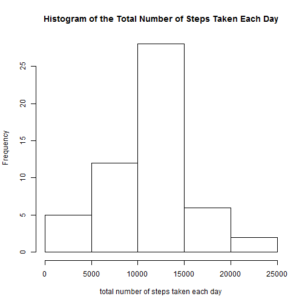
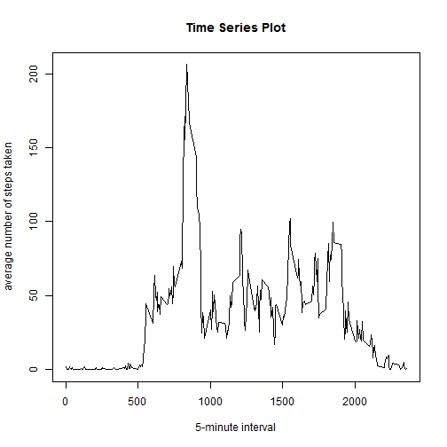
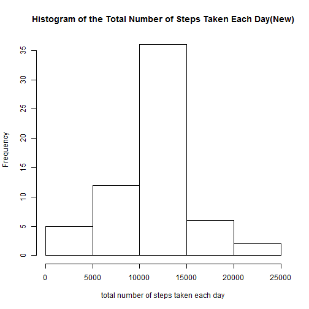
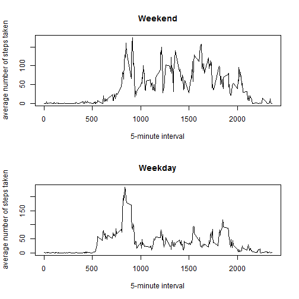

# Reproducible Research: Peer Assessment 1


## Loading and preprocessing the data

```r
unzip("activity.zip")
activity <- read.csv("~/GitHub/RepData_PeerAssessment1/activity.csv")
```
## What is mean total number of steps taken per day?
1. Make a histogram of the total number of steps taken each day
Histogram of the Total Number of Steps Taken Each Day

```r
sumperday <-tapply(activity$steps,activity$date,sum,na.rm=F)
nonasumperday<-sumperday[complete.cases(sumperday)]
hist(x=nonasumperday,xlab="total number of steps taken each day",main="Histogram of the Total Number of Steps Taken Each Day")
```

 

```r
meanday <-tapply(activity$steps,activity$date,mean,na.rm=F)
```
2.Calculate and report the mean and median total number of steps taken per day  
mean 

```r
mean(nonasumperday)
```

```
## [1] 10766
```
median

```r
median(nonasumperday)
```

```
## [1] 10765
```
## What is the average daily activity pattern?
1.Make a time series plot (i.e.type = "l") of the 5-minute interval (x-axis) and the average number of steps taken, averaged across all days (y-axis)

```r
##find the average number of steps taken and clean the data
intervalaverage <-tapply(activity$steps,activity$interval,mean,na.rm=T)
intervalday<-row.names(intervalaverage)
intervalday <-as.numeric(intervalday)
intervalaverage<-cbind(intervalaverage,intervalday)
rownames(intervalaverage)<-NULL

##plot
plot(x=intervalaverage[,2],y=intervalaverage[,1],type="l",xlab="5-minute interval",ylab="average number of steps taken",main="Time Series Plot")
```

 

2.Which 5-minute interval, on average across all the days in the dataset, contains the maximum number of steps?

```r
##find the max location
maxrownumber<- which.max(intervalaverage[,1])
intervalaverage[[maxrownumber,2]]
```

```
## [1] 835
```
## Imputing missing values
1.Calculate and report the total number of missing values in the dataset (i.e. the total number of rows with NAs)

```r
result <-table(complete.cases(activity$steps))
result[[1]]
```

```
## [1] 2304
```
2.Devise a strategy for filling in all of the missing values in the dataset. The strategy does not need to be sophisticated. For example, you could use the mean/median for that day, or the mean for that 5-minute interval, etc.

```r
value<-10766/288
activitynew <- activity
activitynew$steps[is.na(activitynew$steps)] <-value
```
3.Create a new dataset that is equal to the original dataset but with the missing data filled in.

the answer as 1.

4.Make a histogram of the total number of steps taken each day and Calculate and report the mean and median total number of steps taken per day. Do these values differ from the estimates from the first part of the assignment? What is the impact of imputing missing data on the estimates of the total daily number of steps?

```r
sumperdaynew <-tapply(activitynew$steps,activitynew$date,sum,na.rm=F)
nonasumperdaynew<-sumperdaynew[complete.cases(sumperdaynew)]
hist(x=nonasumperdaynew,xlab="total number of steps taken each day",main="Histogram of the Total Number of Steps Taken Each Day(New)")
```

 
mean 

```r
mean(nonasumperdaynew)
```

```
## [1] 10766
```
median

```r
median(nonasumperdaynew)
```

```
## [1] 10766
```
## Are there differences in activity patterns between weekdays and weekends?
1.Create a new factor variable in the dataset with two levels ¡V ¡§weekday¡¨ and ¡§weekend¡¨ indicating whether a given date is a weekday or weekend day.

```r
## add weekday into dataset
Sys.setlocale("LC_TIME", "C")
```

```
## [1] "C"
```

```r
weekday <-weekdays(as.Date(activity[,2]))
weekday <-gsub("Monday","weekday",weekday)
weekday <-gsub("Tuesday","weekday",weekday)
weekday <-gsub("Wednesday","weekday",weekday)
weekday <-gsub("Thursday","weekday",weekday)
weekday <-gsub("Friday","weekday",weekday)
weekday <-gsub("Saturday","weekend",weekday)
weekday <-gsub("Sunday","weekend",weekday)
activityweekdays <- cbind(activity,weekday)
```
2.Make a panel plot containing a time series plot (i.e. type = "l") of the 5-minute interval (x-axis) and the average number of steps taken, averaged across all weekday days or weekend days (y-axis). The plot should look something like the following, which was creating using simulated data:

```r
##seperate the data
activityweekday<-activityweekdays[weekday=="weekday",]
activityweekend<-activityweekdays[weekday=="weekend",]
##get the mean in weekdays and clean
weekdaymean<-tapply(activityweekday$steps,activityweekday$interval,mean,na.rm=T)
weekdaymean<-cbind(weekdaymean,intervalday)
weekdaymean<-cbind(weekdaymean,rep("weekday",288))
## get the mean in weekends and clean
weekendmean<-tapply(activityweekend$steps,activityweekend$interval,mean,na.rm=T)
weekendmean<-cbind(weekendmean,intervalday)
weekendmean<-cbind(weekendmean,rep("weekday",288))
##combine two datas to one and rewrite the colnames and clean the rownames
means <-rbind(weekdaymean,weekendmean)
```


```r
##plot
par(mfrow = c(2,1))
plot(x=weekendmean[,2],y=weekendmean[,1],type="l",xlab="5-minute interval",ylab="average number of steps taken",main="Weekend")
plot(x=weekdaymean[,2],y=weekdaymean[,1],type="l",xlab="5-minute interval",ylab="average number of steps taken",main="Weekday")
```

 
